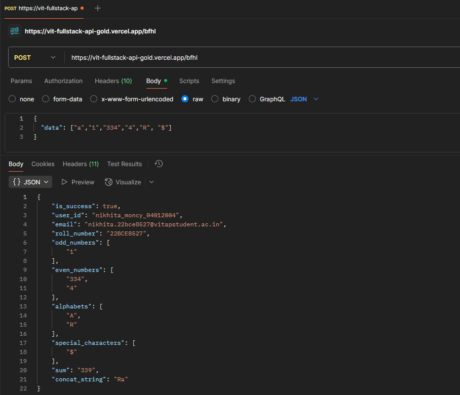

# VIT Full Stack API Challenge

## Overview
REST API that processes arrays and returns categorized data including numbers, alphabets, and special characters.

## API Endpoint
**POST** `/bfhl`

## Request Format
Send POST request with JSON body:
```json
{
  "data": ["a","1","334","4","R", "$"]
}
```
## Hosted endpoint
https://vit-fullstack-api-gold.vercel.app/bfhl

https://vit-fullstack-dmq91gufr-nikhitas-projects-99d486ab.vercel.app/


## API Test Screenshot

